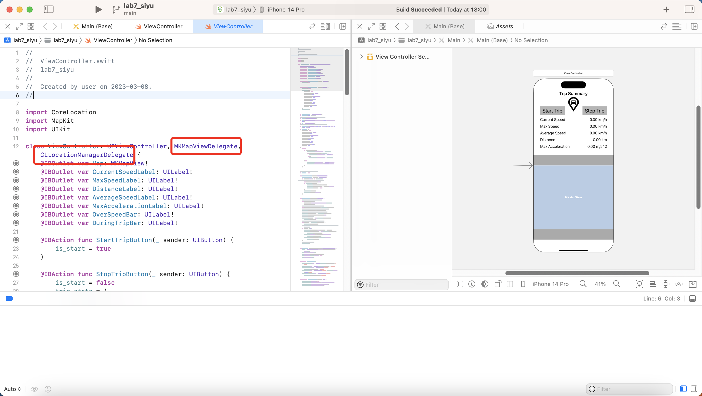
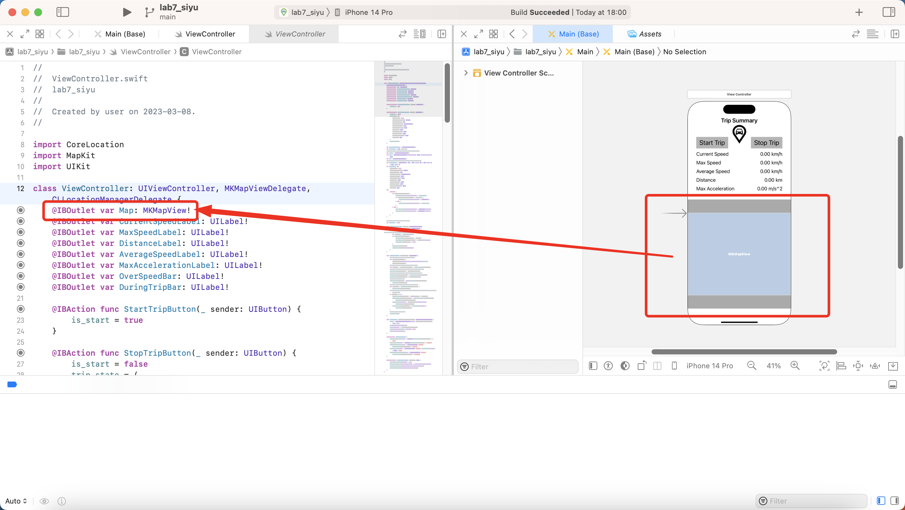
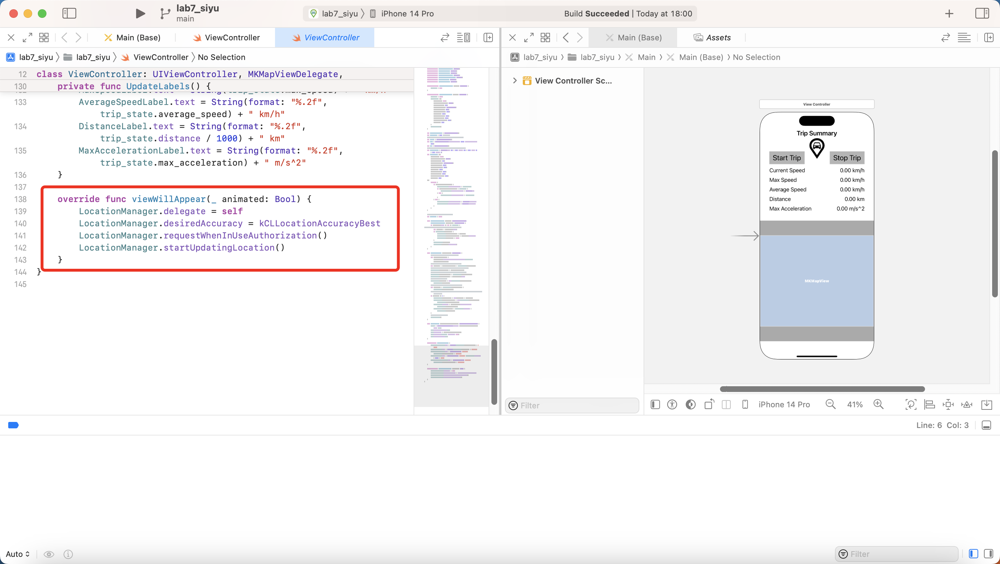
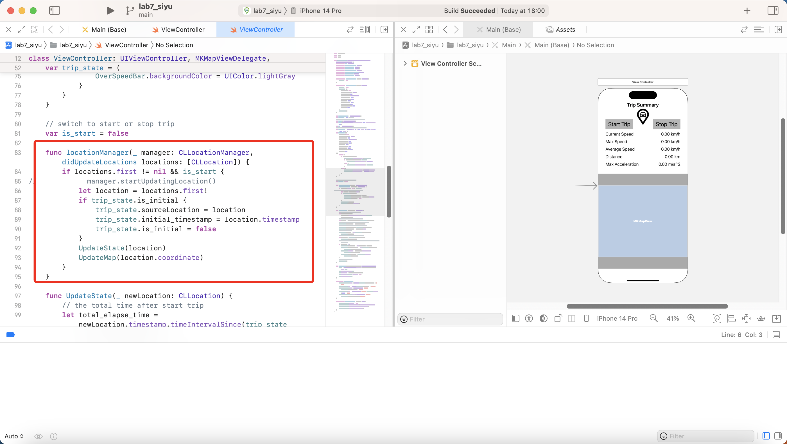
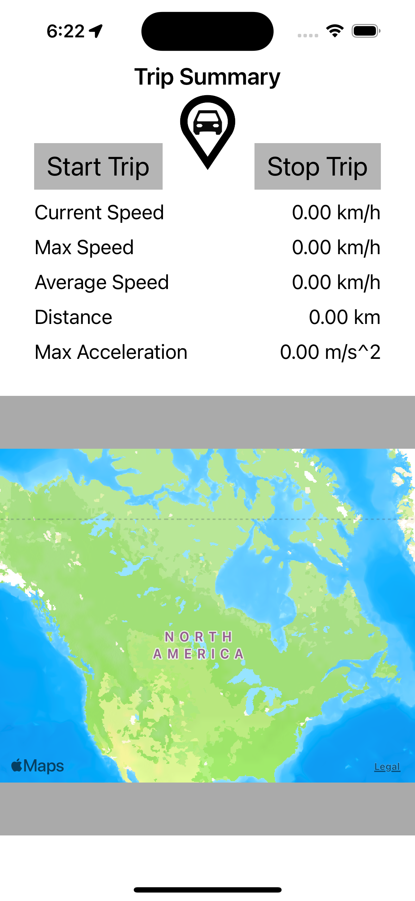
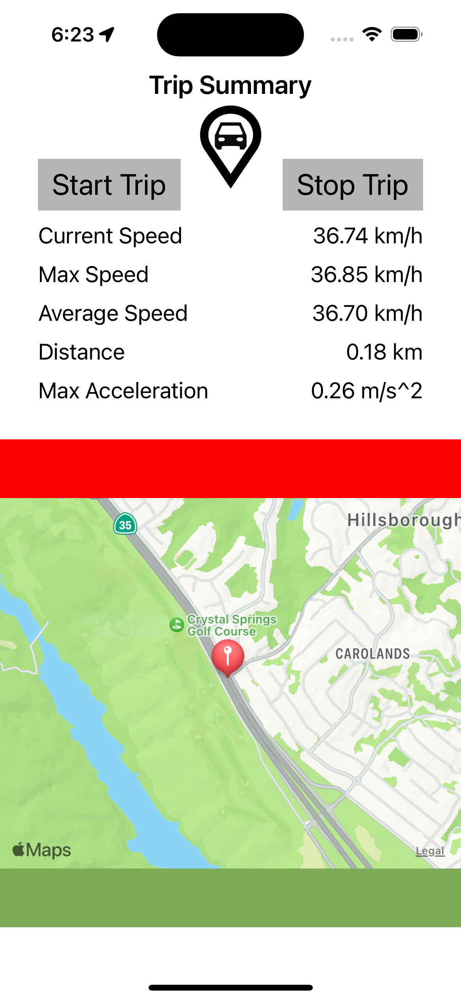

# PROG8470-IOS-Lab7-GPS-simulator

Lab7 UIKit project of PROG8470 IOS development of Conestoga College. This SPA project use MapKit api and MKMapView to simulate location and other info.

## MKMapView

Import MKMapViewDelegate and CLLocationManagerDelegate and implement.

Bind property with the MKMapView of the viewController

Set the delegate, accuracy, and related authorization in the viewWillAppear hook.

The implement delegate will import the locationManager function, this is the place to update location and related info continuously.

## Running Screenshot

